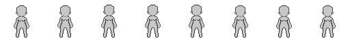

Чтобы добавить спрайт на сцену создадим 2D ноду "AnimatedSprite2D". В инспекторе создадим новый фрейм. Далее на шкале анимации выберем "Добавить кадры из спрайт-листа" (Ctrl+Shift+O). В открывшемся окне необходимо определить количество столбцов и строк.  
<br/>
  
<br/>
В данном случае row = 1, column = 8.
Чтобы завершить, нажимаем "Выделить все", а следом "Добавить кадры".  
<br/>
  
<br/>
Теперь интерфейс выглядит так.

Чтобы убрать размывающий фильтр и пиксельное изображение было четким, заходим в настройки проекта и во вкладке "рендеринг" - "текстуры" выбираем фильтр "Nearest MipMap", либо ту же самую настройку в инспекторе спрайта во вкладке "Texture"-"Filter".

Для удобства увеличим размер спрайта с 1х1 до 9х9, например.

В ноду сцены добавим три элемента ColorPickerButton.

Нам предстоит работа с шейдерами. В инспекторе спрайта, во вкладке Material создаем новый ShaderMaterial.

```
shader_type canvas_item;
uniform vec4 oldcolor1 : source_color;
uniform vec4 oldcolor2 : source_color;
uniform vec4 oldcolor3 : source_color;

uniform vec4 newcolor1 : source_color;
uniform vec4 newcolor2 : source_color;
uniform vec4 newcolor3 : source_color;

void fragment() {
    vec4 curr_color = texture(TEXTURE,UV); 
	
    if(distance(COLOR, oldcolor1) < 0.1){
        COLOR = newcolor1;
	}
	else if(distance(COLOR, oldcolor2) < 0.1)
	{
		 COLOR = newcolor2;
    }
	else if (distance(COLOR, oldcolor3) < 0.1)
	{
        COLOR = newcolor3;
    }
	else
	{
        COLOR = curr_color;
    }
}
```
Данный код позволит нам уже менять цвет элементов спрайта через параметры шейдера.

Когда мы сравниваем цвета, мы используем интерполяцию из-за особенностей движка, потому что при выборе цвета пипеткой получается не точное значение.  
<br/>
  
<br/>
Нужно выделить Oldcolor и пипеткой навести на цвет, который мы собираемся менять. Тело стало чёрным, теперь выбираем Newcolor с помощью цветового круга. На кнопке ColorPickerButton устанавливаем цвет из параметра шейдера Oldcolor.

К AnimatedSprite2D прикрепляем новый скрипт на GDScript. Выбрав снова ColorPickerButton, на панели справа во вкладке "Узел" нажимаем "color_changed(color: Color)", чтобы присоединить сигнал к только что созданному скрипту нажимаем соответствующую кнопку. В файле скрипта появится новая функция, которая срабатывает при выборе цвета на палитре цветовой кнопки.
```GDScript
extends AnimatedSprite2D


func _on_color_picker_button_color_changed(color):
	material.set("shader_parameter/newcolor1",color)
	pass 


func _on_color_picker_button_2_color_changed(color):
	material.set("shader_parameter/newcolor2",color)
	pass


func _on_color_picker_button_3_color_changed(color):
	material.set("shader_parameter/newcolor3",color)
	pass 
```
Данный скрипт меняет цвет спрайта в соответствии со значением, выбранным на палитре.

Механика смены цвета спрайта и его элементов реализована.

Чтобы запустить анимацию, работающую в проекте, нужно выбрать спрайт, убедиться что функция "Автовоспроизведение" активна и нажать "Воспроизвести выбранную анимацию с текущей позиции". Проект запускается с помощью горячей клавиши F5 или кнопки на верхней панели "Запустить проект".
